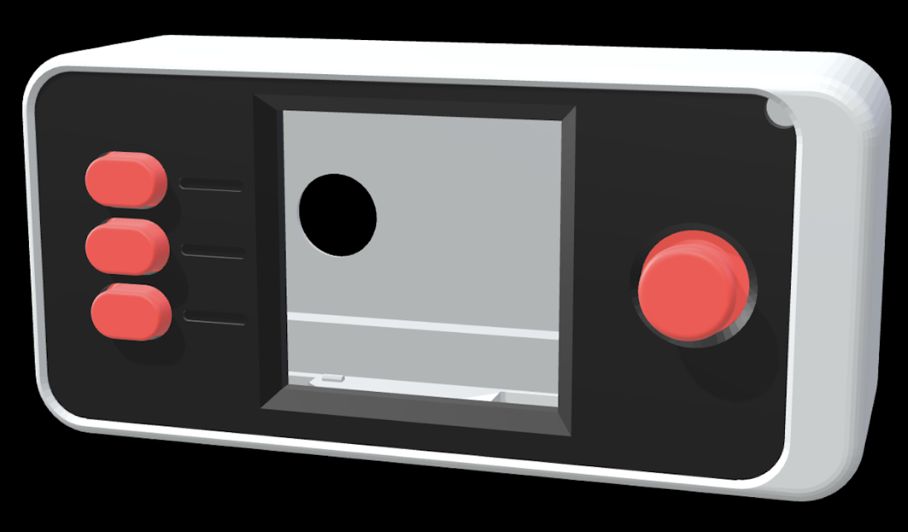
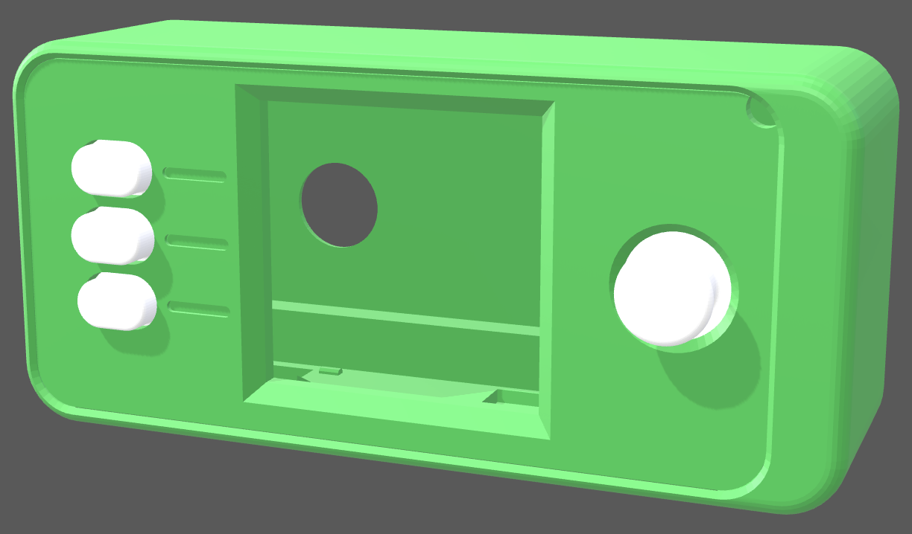
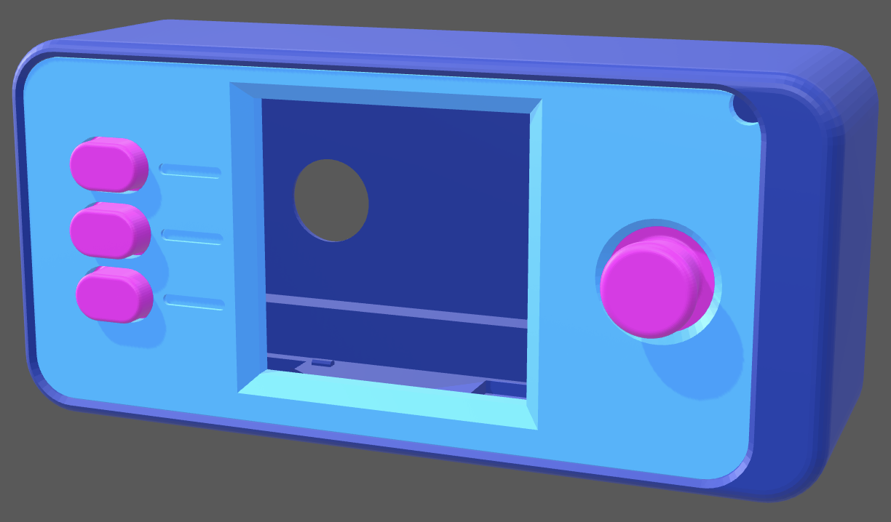
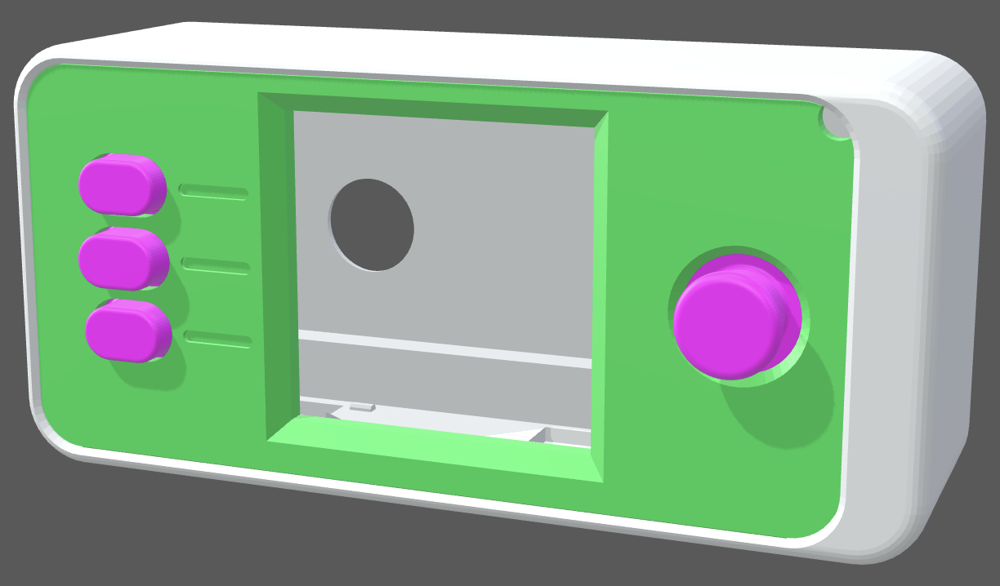
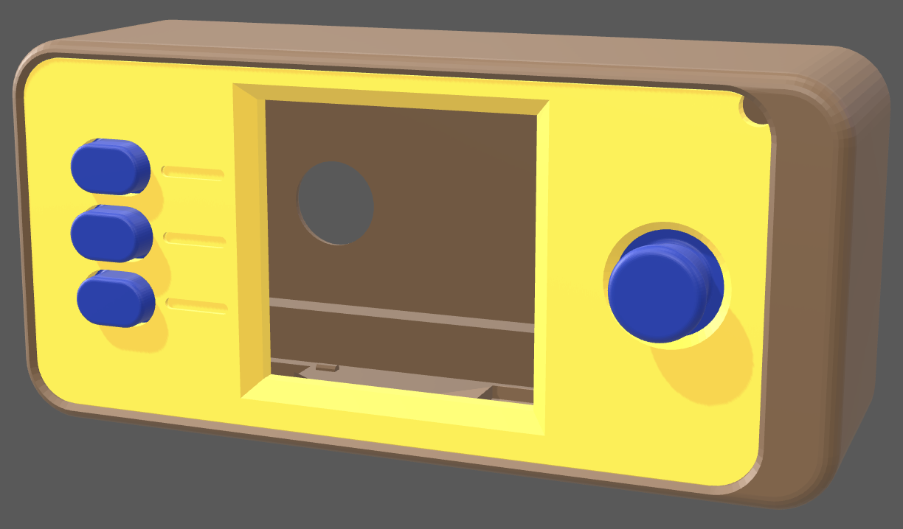
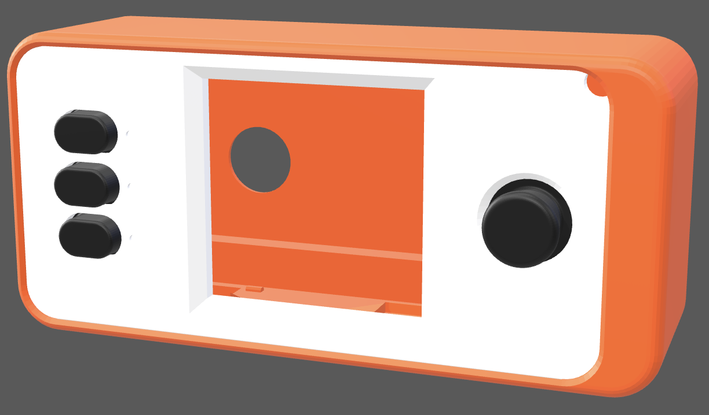
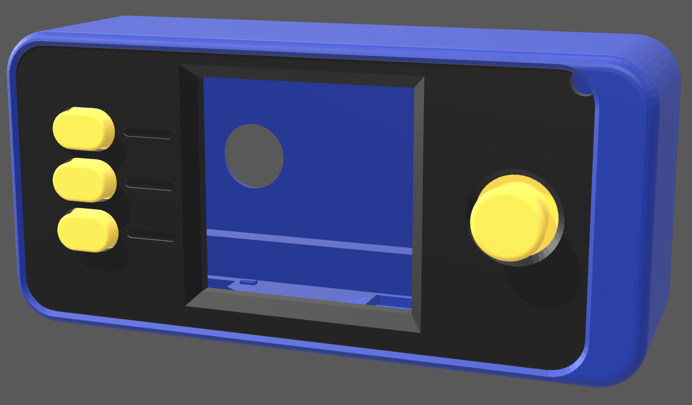

# Themed SeedSigners

## Nintendo

NES Controller

https://zalgebar.com/3d-colorator/?collection=seedsigner&print=open_pill_mini_w_coverplate&main_chassis=grey&lid=black&thumbstick=red&buttons=red

## Monsters Inc.

Mike

https://zalgebar.com/3d-colorator/?collection=seedsigner&print=open_pill_mini_w_coverplate&main_chassis=green&lid=green&thumbstick=white&buttons=white

Sully

https://zalgebar.com/3d-colorator/?collection=seedsigner&print=open_pill_mini_w_coverplate&main_chassis=blue&lid=blue_pastel&thumbstick=purple&buttons=purple

## Toy Story

Buzz

https://zalgebar.com/3d-colorator/?collection=seedsigner&print=open_pill_mini_w_coverplate&main_chassis=grey&lid=green&thumbstick=purple&buttons=purple

Woody

https://zalgebar.com/3d-colorator/?collection=seedsigner&print=open_pill_mini_w_coverplate&main_chassis=brown&lid=yellow&thumbstick=blue&buttons=blue

## Finding Nemo

Marlin/Nemo

https://zalgebar.com/3d-colorator/?collection=seedsigner&print=open_pill_mini_w_coverplate&main_chassis=orange&lid=white&thumbstick=black&buttons=black

Dory

https://zalgebar.com/3d-colorator/?collection=seedsigner&print=open_pill_mini_w_coverplate&main_chassis=blue&lid=black&thumbstick=yellow&buttons=yellow

## Disclaimer

Toy Story, Finding Nemo, Monsters Inc., Nintendo and related names are property of their respective owners. Zalgebar makes no claim to ownership over the third-party intellectual property referenced on this page.